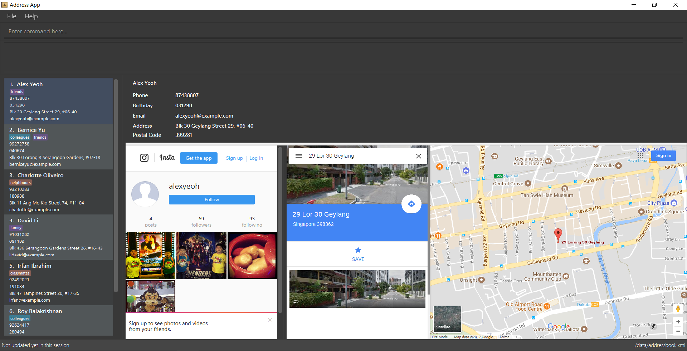

= Bevy
ifdef::env-github,env-browser[:relfileprefix: docs/]
ifdef::env-github,env-browser[:outfilesuffix: .adoc]

https://travis-ci.org/CS2103AUG2017-T16-B3/main[image:https://travis-ci.org/CS2103AUG2017-T16-B3/main.svg?branch=master[Build Status]]
https://ci.appveyor.com/project/thegreatkang/Bevy[image:https://ci.appveyor.com/api/projects/status/2dji4mg1omnchm0e/branch/master?svg=true[Build status]]
https://coveralls.io/github/CS2103AUG2017-T16-B3/Bevy?branch=master[image:https://coveralls.io/repos/github/CS2103AUG2017-T16-B3/Bevy/badge.svg?branch=master[Coverage Status]]
https://www.codacy.com/app/johnweikangong/Bevy?utm_source=github.com&amp;utm_medium=referral&amp;utm_content=CS2103AUG2017-T16-B3/Bevy&amp;utm_campaign=Badge_Grade[image:https://api.codacy.com/project/badge/Grade/444623e8f444417c86eb848de255924a[Codacy Badge]]

ifdef::env-github[]

endif::[]

ifndef::env-github[]
image::images/Ui.png[width="600"]
endif::[]

Have you ever forget that special friend's birthday? Or that memorable event you have had with
a friend?

In today's interconnectedness, we are making more friends than we can ever imagine, but
at the same time, we are losing many of them because of our forgetfulness. If that is you,
then this app is for you.

Bevy is a powerful app that helps you to remember your friends again. It simplifies your friends' information in a
single place and provide more. Bevy is smart to know what your friends are up to in their social media and even gives
you a sneak peek into their location.

Excited? We are too, because we *love* connecting you with Bevy.

== Site Map

* <<UserGuide#, User Guide>>
* <<DeveloperGuide#, Developer Guide>>
* <<LearningOutcomes#, Learning Outcomes>>
* <<AboutUs#, About Us>>
* <<ContactUs#, Contact Us>>

== Acknowledgements

* Some parts of this sample application were inspired by the excellent http://code.makery.ch/library/javafx-8-tutorial/[Java FX tutorial] by
_Marco Jakob_.

== Licence : link:LICENSE[MIT]
